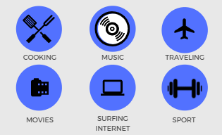

# Tkachuk Ivan

### CONTACTS
<a href='mailto:tkachukione@gmail.com'>tkachukione@gmail.com</a>

<a href='tel:+380-668-569-547'>mobile phone +380668569547 </a>
## PERSONAL DETAILS

Extremely motivated to constantly develop my skills and grow professionally. A highly motivated, confident individual with exceptional multi-tasking capabilities 
and able to work in a target driven. Hardworking with 
excellent attendance and punctuality records who can work equally well alone or as part of a team.

## EDUCATION
Bachelor and masters degree   in Igor Sikorsky Kyiv Polytechnic Institute,  faculty of electronics

## SKILLS
- intermediate level of English and elementary level of Germany
- Successful working in a team environment, as well as independently
- Knowledge of python, CSS + HTML, JS
- The ability to follow instructions and deliver quality results
- Person with a various skill-set, a lot of integrity and a willingness to go the extra mile to achieve goal.

## INTERESTS

